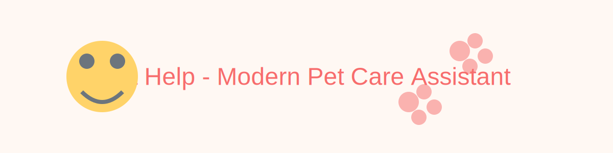

# 🐾 Pet Help

A modern, premium pet care assistant built with React, helping pet owners take the best care of their furry friends. This application features a friendly UI with smooth animations, accessibility support, and responsive design.



## ✨ Features

- **Premium UI/UX**: Glassmorphic components, subtle animations, and a carefully crafted color palette for a modern, friendly look
- **Animated Landing Page**: Eye-catching hero section with animated pet icons and scroll indicators
- **Smart Chat Interface**: AI-powered chat assistant with adaptive pet icon reactions
- **Symptom Checker**: Interactive health assessment with visual indicators and recommendations
- **Vet Finder**: Map integration with Google Maps API to locate nearby veterinarians
- **File Upload System**: Drag-and-drop medical record uploads with visual feedback
- **Emergency Alert**: High-visibility overlay with quick-access emergency information
- **Fully Responsive**: Mobile-first design that works beautifully on all device sizes
- **Accessibility Support**: WCAG-compliant design with reduced motion preferences support

## 🛠️ Tech Stack

- **Frontend Framework**: [React 18](https://reactjs.org/) with [Vite](https://vitejs.dev/) for lightning-fast development
- **Styling**: [Tailwind CSS v3](https://tailwindcss.com/) with custom utilities and [@tailwindcss/forms](https://github.com/tailwindlabs/tailwindcss-forms)
- **Animations**: [Framer Motion](https://www.framer.com/motion/) for smooth, physics-based animations
- **Visual Assets**: [Lottie](https://airbnb.io/lottie/) for lightweight, scalable animations
- **Map Integration**: [Google Maps API](https://developers.google.com/maps) for vet location services
- **Fonts**: [Poppins](https://fonts.google.com/specimen/Poppins) (headings) and [Nunito](https://fonts.google.com/specimen/Nunito) (body) via @fontsource

## 🚀 Getting Started

### Prerequisites

- Node.js 16.x or higher
- npm 8.x or higher

### Installation

1. **Clone the repository**

   ```bash
   git clone https://github.com/yourusername/pet-help.git
   cd pet-help
   ```

2. **Install dependencies**

   ```bash
   npm install
   ```

3. **Set up environment variables**
   
   Create a `.env.local` file in the project root:

   ```
   VITE_GOOGLE_MAPS_API_KEY=your_google_maps_api_key
   ```

4. **Start the development server**

   ```bash
   npm run dev
   ```

5. **Access the application**
   
   Open [http://localhost:5173](http://localhost:5173) in your browser

## 📂 Project Structure

```
pet-help/
├── .github/                    # GitHub workflows and templates
├── public/                     # Static assets
│   └── assets/
│       ├── PetIcon.png         # 3D pet illustration
│       ├── loader.json         # Lottie animation file
│       ├── paw-pin.png         # Map marker icon
│       ├── readme-banner.svg   # README banner image
│       └── ...
├── src/
│   ├── components/             # Reusable UI components
│   │   ├── AlertOverlay.jsx    # Emergency alert overlay
│   │   ├── Header.jsx          # Navigation header
│   │   ├── LoaderLottie.jsx    # Loading animation
│   │   ├── PetIcon.jsx         # Pet character icons
│   │   └── ...
│   ├── hooks/                  # Custom React hooks
│   │   └── useIntersectionObserver.js
│   ├── pages/                  # Main application pages
│   │   ├── Landing.jsx         # Home page
│   │   ├── Chat.jsx            # Chat interface
│   │   ├── SymptomChecker.jsx  # Health assessment
│   │   ├── VetFinder.jsx       # Map integration
│   │   └── FileUpload.jsx      # Document uploading
│   ├── styles/                 # Global styles
│   │   └── animations.css      # Scroll animations
│   ├── utils/                  # Utility functions
│   │   ├── theme.js            # Theme configuration
│   │   └── scrollAnimations.js # Scroll behavior
│   ├── App.jsx                 # Main application component
│   ├── App.css                 # Base component styles
│   ├── main.jsx                # Application entry point
│   └── index.css               # Global styles
├── .eslintrc.js                # ESLint configuration
├── .prettierrc                 # Prettier configuration
├── index.html                  # HTML entry point
├── tailwind.config.js          # Tailwind CSS configuration
├── vite.config.js              # Vite configuration
└── README.md                   # Project documentation
```

## 🎨 Customization

### Theme Customization

The application uses a centralized theme system defined in `src/utils/theme.js`. You can modify colors, typography, shadows, and animation parameters in this file.

```javascript
// Example from theme.js
export const theme = {
  colors: {
    primary: '#F76C6C',
    accent: '#FFD369',
    // ...other colors
  },
  // ...other theme properties
};
```

### Tailwind Extensions

The project extends Tailwind with custom utilities in `tailwind.config.js`:

- `.glassmorphism` - Creates a frosted glass effect
- `.gradient-text` - Applies a text gradient
- `.elevated-card` - Creates a floating card with hover effects
- `.reduced-motion` - Respects user preferences for reduced motion

### Assets

Replace the placeholder assets with your own:

- **Pet Icon**: Update `PetIcon.png` or modify the `PetIcon` component to use your preferred pet illustration
- **Animations**: Replace the Lottie JSON files in `public/assets/` 
- **Map Markers**: Update `paw-pin.png` to customize map location indicators
- **README Banner**: Replace `readme-banner.svg` with your custom project banner

## 📱 Responsive Design

The application is built with a mobile-first approach:

- **Small screens**: Single-column layout with optimized touch targets
- **Medium screens**: Two-column layouts for better content organization
- **Large screens**: Full desktop experience with enhanced visualizations

## ♿ Accessibility

Pet Help is designed with accessibility in mind:

- **Keyboard Navigation**: Full keyboard support for all interactive elements
- **Screen Readers**: Semantic HTML and ARIA attributes for assistive technologies
- **Reduced Motion**: Alternative animations for users with motion sensitivity
- **Color Contrast**: WCAG AA-compliant color combinations

## 🚢 Deployment

### Vercel Deployment

1. Push your code to a GitHub repository
2. Import the project in [Vercel](https://vercel.com)
3. Set up environment variables
4. Deploy!

### Netlify Deployment

1. Push your code to a GitHub repository
2. Import the project in [Netlify](https://netlify.com)
3. Configure build settings:
   - Build command: `npm run build`
   - Publish directory: `dist`
4. Set up environment variables
5. Deploy!

## 🧪 Testing

Run the test suite with:

```bash
npm test
```

## 📦 Build for Production

Create an optimized production build:

```bash
npm run build
```

Preview the production build:

```bash
npm run preview
```

## 📄 License

This project is licensed under the MIT License - see the [LICENSE](LICENSE) file for details.

## 🙏 Acknowledgements

- Pet illustrations inspired by [IconScout](https://iconscout.com/)
- UI design inspired by modern pet care applications
- Special thanks to all contributors and the open-source community

---

**Note:** All sample assets are placeholders. Replace with your own assets before deploying to production.
